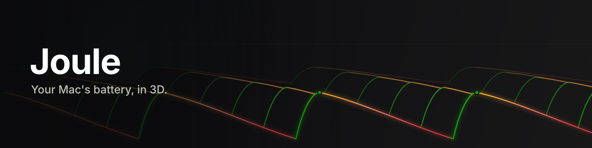
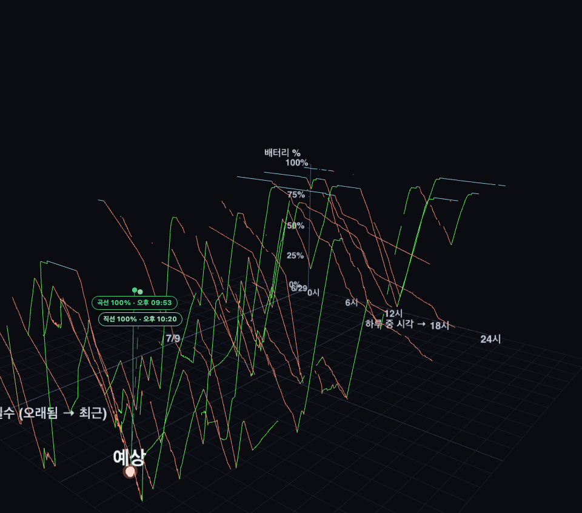
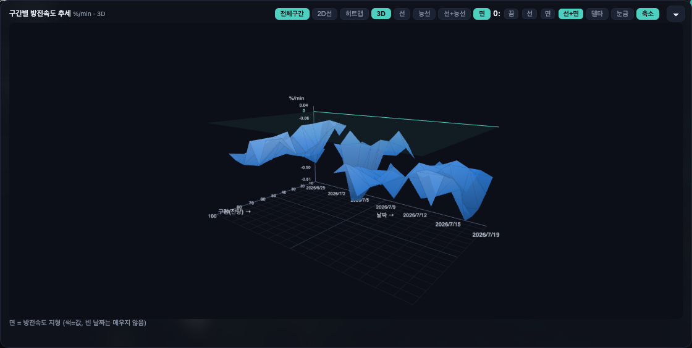
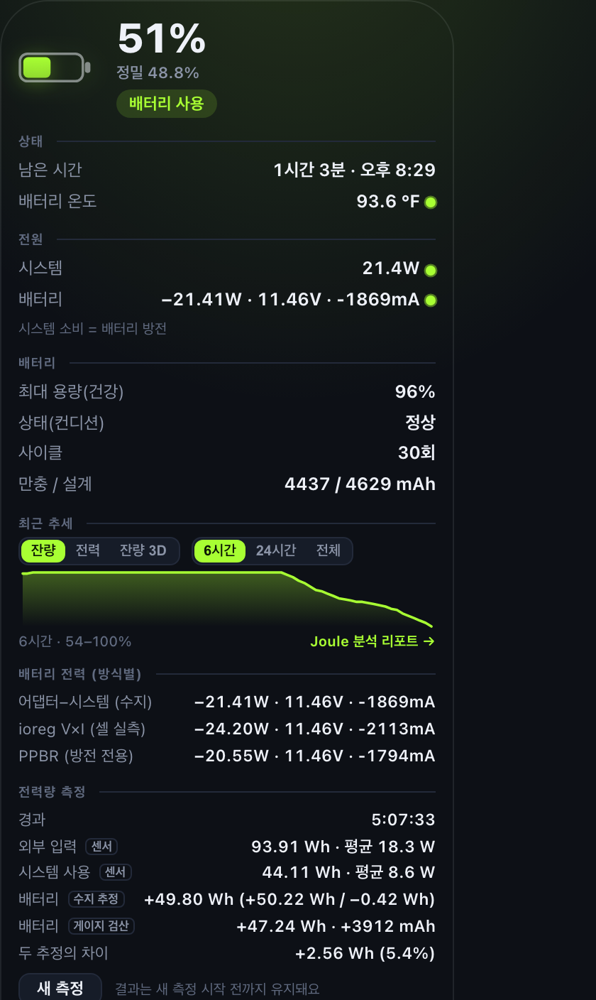
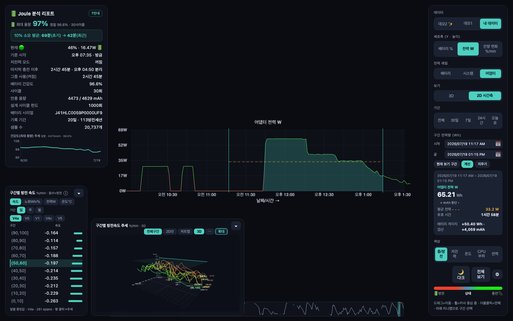
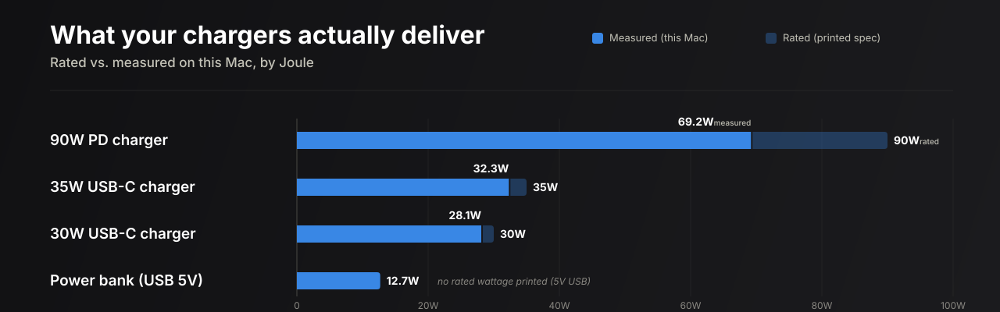
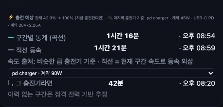
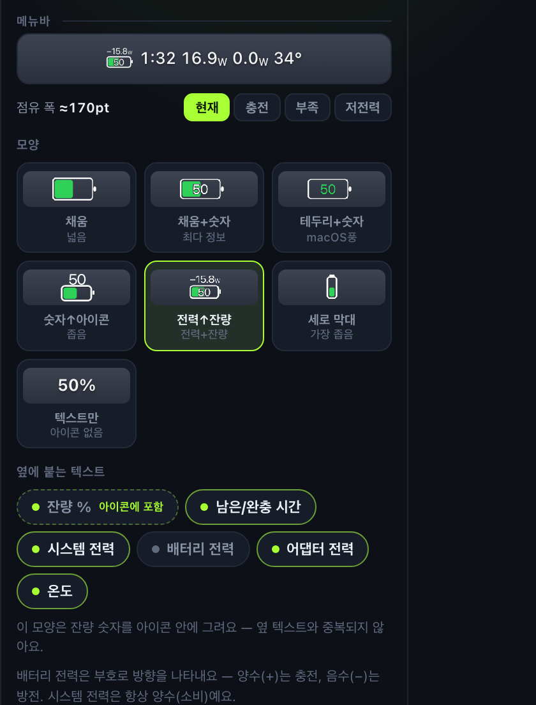
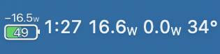
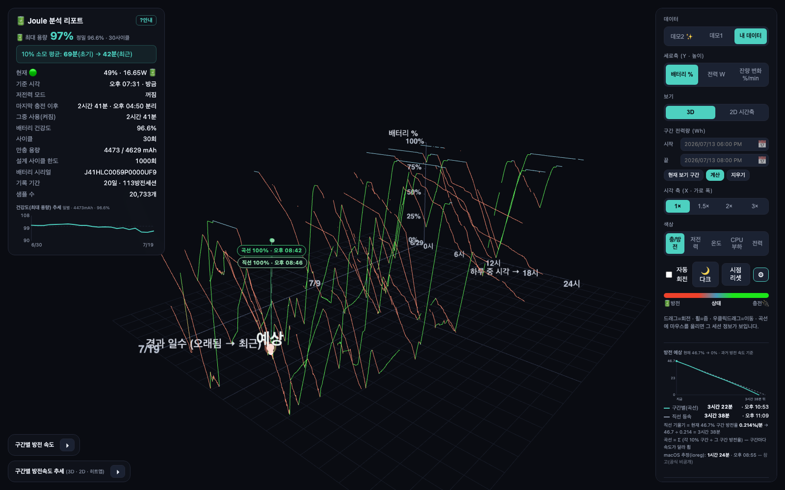

<p align="center">
  
</p>

<p align="center">
  <a href="README.md">🇺🇸 English README</a>
</p>

<h1 align="center">Joule — 배터리·전력·충전 분석기</h1>

<p align="center"><b>맥 배터리를, 3D로.</b><br>
20일치 충전·방전을 직접 돌려보고, 재고, 마침내 이해합니다 —<br>
실제 충전기 출력과 두 방식으로 교차검증한 전력량까지.</p>

<p align="center">
  <a href="https://github.com/kim-dongryeong/joule-battery-power-charging-analyzer/releases/latest"></a>
  <a href="https://github.com/kim-dongryeong/joule-battery-power-charging-analyzer/releases/latest"></a>
  <a href="https://github.com/kim-dongryeong/joule-battery-power-charging-analyzer/releases/latest"></a>
</p>

<p align="center">
  <a href="https://github.com/kim-dongryeong/joule-battery-power-charging-analyzer/releases/latest">
    
  </a>
</p>

<p align="center">
  1. DMG 다운로드(Apple Silicon / Intel) → 2. Joule을 응용 프로그램으로 드래그 → 3. 실행 — 메뉴바에 상주합니다.<br>
  자동 업데이트. 맥을 벗어나는 데이터는 없습니다.
</p>

<br>

<p align="center">
  
</p>

<p align="center"><i>다른 배터리 앱은 '오늘'을 그립니다. Joule은 지난 3주를 지형으로 그립니다.</i></p>

## Joule을 선택하는 이유

배터리 앱은 숫자를 보여줍니다. Joule은 시간에 걸친 이야기를 보여줍니다 — 어떤 앱도 그리지 않는 3D 이력, 라벨이 아닌 실제 충전기 출력, 그리고 서로 다른 두 방식으로 재서 교차검증한 전력량.

## 주요 기능

### '지금'이 아니라 '시간'을 봅니다

<p align="center"></p>
<p align="center"><sub>20일치 방전·충전 곡선을 3D로 돌려보고, 진짜 배터리 노화와 무거운 앱을 쓴 날을 분리합니다.</sub></p>

### 숫자를 두 번 믿습니다

<p align="center"></p>
<p align="center"><sub>메뉴바에서 한 번 클릭: 서로 다른 세 가지 방식으로 잰 실시간 전력을 교차검증하고, 실시간으로 쌓이는 전력량 적산까지.</sub></p>

### 급속충전, 끝까지 측정

<p align="center"></p>
<p align="center"><sub>충전기가 31분간 약 60W 고원을 유지했고, 두 시간짜리 세션 전체를 적분하면 65.21Wh — 배터리 게이지(+50.40Wh / +4,059mAh, 두 독립 추정치가 5% 차이)로 교차검증했습니다.</sub></p>

### 내 충전기의 실력

<p align="center"></p>
<p align="center"><sub>90W PD 충전기는 여기서 69.2W, 35W 충전기는 32.3W, 30W 충전기는 28.1W, 보조배터리는 12.7W — Joule은 각각을 식별하고 라벨이 아닌 실제 출력을 잽니다.</sub></p>

### 다른 충전기였다면?

<p align="center"></p>
<p align="center"><sub>"다른 충전기였다면?" 손 뻗기 전에 어댑터별 완충 예상 시간을 비교하세요.</sub></p>

### 내가 디자인하는 메뉴바 칩

<p align="center"></p>
<p align="center"><sub>레이아웃을 확정하기 전에, 트레이가 그릴 실제 픽셀을 그대로 WYSIWYG로 미리 봅니다.</sub></p>

<p align="center"></p>
<p align="center"><sub>메뉴바에 상주하는 라이브 칩 — ETA·전력·온도를 언제나 한눈에.</sub></p>

## 수치로 증명

실제 맥 한 대에서 만들고 검증:

- **20.4일** 기록
- **60초 간격 20,717** 샘플
- **113** 방전 세션
- **최장 25.5시간** 연속(100% → 35%)
- **101.3% → 97.3%** 건강도 추적

## 전체 화면

<p align="center"></p>
<p align="center"><sub>3D 이력, 실시간 측정치, 그리고 그것을 탐색할 컨트롤까지 창 하나에.</sub></p>

## 설치

1. [최신 버전](https://github.com/kim-dongryeong/joule-battery-power-charging-analyzer/releases/latest)에서 `.dmg` 다운로드 — Apple Silicon(aarch64) 또는 Intel(x86_64) 선택.
2. **Joule**을 응용 프로그램 폴더로 드래그.
3. 실행 — 메뉴바에 상주합니다.

그 이후의 업데이트는 자동입니다. 모든 데이터는 맥 안에만 있고 아무것도 업로드되지 않습니다.

## 측정 원리

Joule은 전력을 세 가지 독립 방식(수지 추정·macOS ioreg·PPBR 방전전용)으로 읽고 서로 맞춰봅니다. 그래서 보이는 W가 단일 추정치가 아닙니다. 완충 시 전력량도 배터리 자체 게이지로 교차검증합니다.

## FAQ

**데이터는 안전한가요?**
네 — 맥을 절대 벗어나지 않습니다. 어떤 것도 업로드되지 않습니다.

**배터리를 닳게 하나요?**
아니요 — 60초 샘플링은 무시할 수준입니다.

**어떤 기종에서 돌아가나요?**
macOS · Apple Silicon & Intel. Joule은 ioreg·ps에 더해 SMC를 직접 읽습니다 — sudo도 커널 확장도 없이.

---

<details>
<summary><b>개발자용 — CLI, 데이터 포맷, 소스 빌드</b></summary>

### 빠른 시작

```bash
node scripts/gen-demo2.js     # 쇼케이스 데모 생성 (3D 뷰 즉시 확인)
npm start                     # 뷰어 → http://localhost:4317   (= node bin/cli.js serve)
```

오른쪽 패널에서 **Demo 2 ✨ (showcase) ↔ Demo 1 ↔ My data** 전환. "My data"는 기록이 쌓이면서 더 풍부해집니다. 메트릭/버전/델타/건강도(Wh/%) 정의는 우상단 **? Help** 패널(`/help.html`)을 참조하세요.

### 기록(시작/중지) 및 데이터 위치

배터리 기록는 60초마다 실행되는 launchd 백그라운드 작업(no `sudo`, ~0% idle CPU). **로그인 시 자동 시작**, 재부팅 후에도 계속됩니다.

```bash
node bin/cli.js record on       # 시작 (= ./install.sh). 간격 변경: record on 120
node bin/cli.js record status   # 실행 중? 지금까지 샘플 개수?
node bin/cli.js record off      # 중지 (= ./uninstall.sh; 수집 데이터 유지)
```

- **실제 데이터 저장 위치**: `~/Library/Application Support/3d-battery-life/samples.jsonl` (환경변수 `BATTERY_DATA`로 변경 가능). npx, 독립 바이너리, Tauri 앱이 모두 **같은 리포트**를 읽습니다. (번들된 `.jsonl` 데모는 앱 자산으로 함께 배포)
- 기록기는 멱등성 — 세 가지 패키징 경로를 모두 거쳐도 중복 데이터 생성 없음.

### 패키징

같은 코어, 세 가지 래퍼 — 모두 같은 웹 뷰어를 재사용.

```bash
# ① npx / CLI  (Node 필요)
npx battery-life serve        # serve · sample · demo · demo2 · install · uninstall
node bin/cli.js help

# ② 독립 바이너리  (Node 불필요, Bun으로 컴파일)
npm run build:binary          # → dist/battery-life (+ dist/web/)
./dist/battery-life serve

# ③ 메뉴바 앱 (.app/.dmg)  — Tauri v2 (빌드 & 실행 검증됨)
npm run build:app             # 바이너리 → sidecar → .app/.dmg  (Bun + Rust + @tauri-apps/cli 필요)
#   더블클릭 → 첫 실행 시 "기록 시작?" 확인 → 뷰어 열기 / 메뉴바 토글로 기록 제어. TAURI.md 참조.
```

> **기록**는 1분마다 launchd 에이전트로 실행 (로그인 시 자동 시작). 시작/중지: **앱**은 첫 실행 시 확인하고 메뉴바 토글 제공; **CLI**는 `battery-life record on/off/status` (= `./install.sh`/`./uninstall.sh`)로 제어.

### 3D 뷰 읽기

| 축 / 요소 | 의미 |
|---|---|
| **X (가로)** | 시간(0–24시) |
| **Y (세로)** | 배터리 % 또는 전력(W) — 패널에서 전환 |
| **Z (깊이)** | 경과 일수(뒤쪽 = 과거, 앞쪽 = 최근) |
| **색상** | 온도 / CPU 부하 / 전력 — 패널에서 전환 |
| **하나의 곡선** | 하나의 방전 세션(언플러그 → 다시 플러그인까지) |

곡선이 Z축으로 더 앞쪽에서 **가팔라**지면, 시간에 따라 방전이 빨라지고 있다는 뜻. 곡선에 마우스를 올리면 해당 세션의 100%→90% 시간, 평균 전력, 온도, 건강도, 최상위 CPU 프로세스를 표시.

### 레이아웃

```
bin/sampler.js      한 번 실행 → data/samples.jsonl에 배터리 스냅샷 한 줄 추가
lib/battery.js      ioreg/pmset 파싱 (보수 표기 음수 전류 포함)
lib/report.js       JSONL → 세션 + 메트릭 (방전율, 100→90 시간, 건강도 추세)
server.js           정적 웹 + /api/report (의존성 없음)
web/                Three.js 3D 뷰어
scripts/gen-demo.js 물리적으로 일관성 있는 1년치 데모 데이터 생성
launchd/            60초 LaunchAgent 템플릿
```

### 기록된 필드 (한 샘플 = 한 JSON 줄)

`pct, rawCap, rawMax, design, healthPct, voltage, amperage, powerW, watts, cycles, tempC, ac, charging, timeRemain, loadPct, topProc/topProcCpu`

- 현재(`Amperage`)는 macOS에서 부호 없는 64비트로 들어오므로, 방전 중에는 음수로 재해석.
- `watts = |voltage × current|` — 직접 부하 측정.
- `healthPct = 만충 용량 / 설계 용량` — 노화 지표.

### 의존성 / 권한

- **Node 18+** 필수만 (npm 의존성 없음; Three.js는 `web/vendor/`에 벤더링됨).
- `sudo` 없음, 커널 확장 없음 — ioreg·ps에 더해 SMC를 직접 읽음.
- 모든 데이터는 로컬 — `~/Library/Application Support/3d-battery-life/` 에만 저장.

### 중지

```bash
./uninstall.sh        # 기록 중지 (data/ 유지됨)
```

</details>
