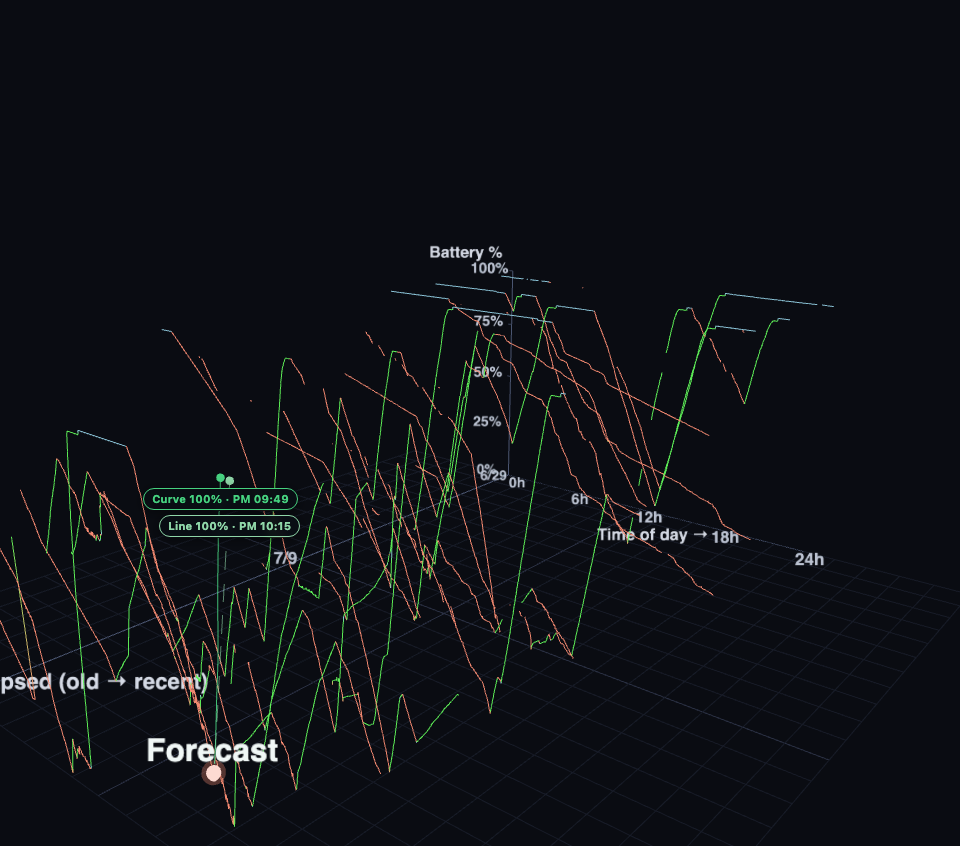
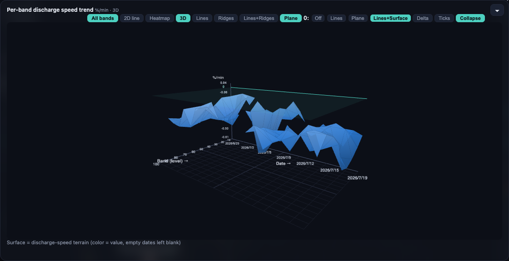
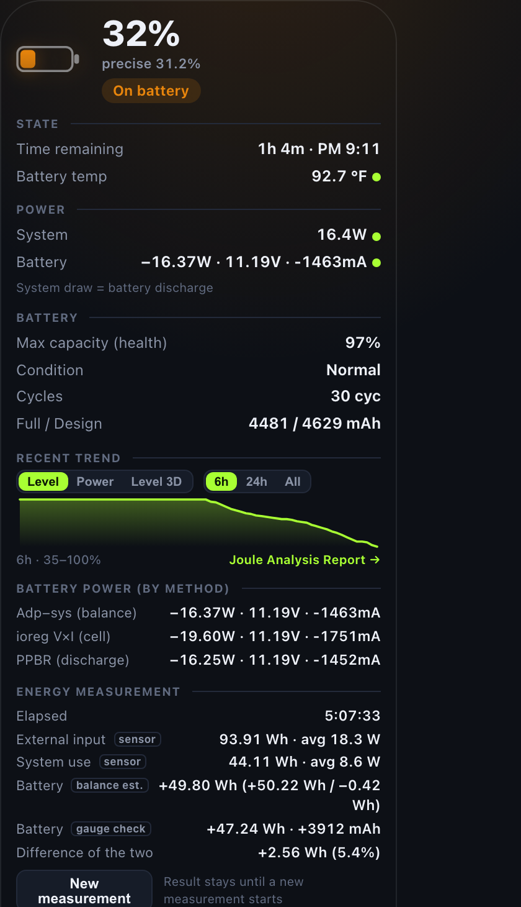
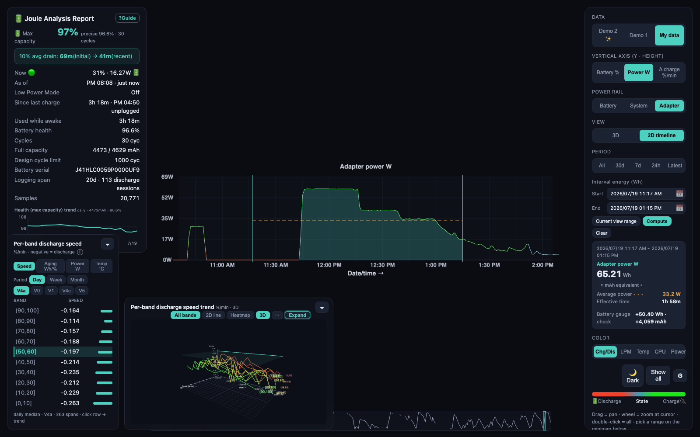
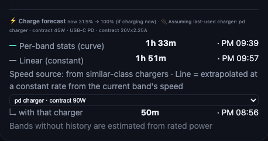
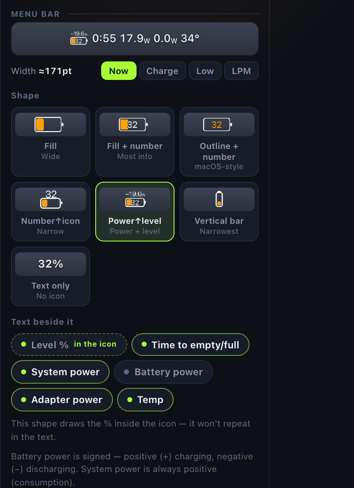
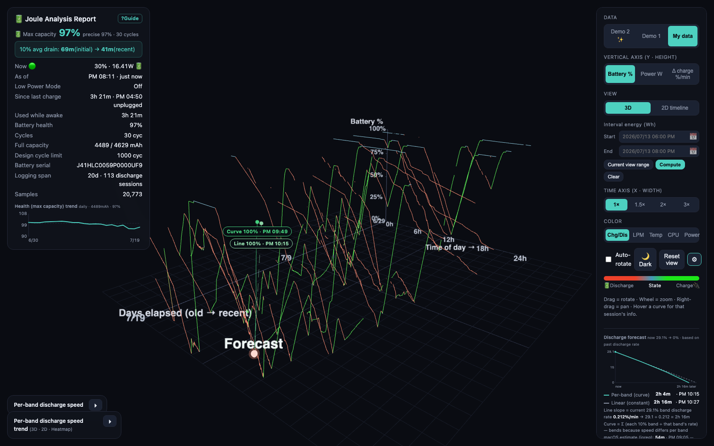

<p align="center">
  
</p>

<p align="center">
  <a href="README.ko.md">🇰🇷 한국어 README</a>
</p>

<h1 align="center">Joule — Battery, Power &amp; Charging Analyzer</h1>

<p align="center"><b>Your Mac's battery, in 3D.</b><br>
Twenty days of charging and discharging you can spin, measure, and finally understand —<br>
with real charger output and energy cross-checked two ways.</p>

<p align="center">
  <a href="https://github.com/kim-dongryeong/joule-battery-power-charging-analyzer/releases/latest"></a>
  <a href="https://github.com/kim-dongryeong/joule-battery-power-charging-analyzer/releases/latest"></a>
  <a href="https://github.com/kim-dongryeong/joule-battery-power-charging-analyzer/releases/latest"></a>
</p>

<p align="center"><sub>macOS · Apple Silicon (Intel: core metrics only — see <a href="#install">Compatibility</a>)</sub></p>

<p align="center">
  <a href="https://github.com/kim-dongryeong/joule-battery-power-charging-analyzer/releases/latest">
    
  </a>
</p>

<p align="center">
  1. Download the DMG (Apple Silicon / Intel) → 2. Drag Joule to Applications → 3. Launch — it lives in your menu bar.<br>
  Auto-updates. Nothing leaves your Mac.
</p>

<br>

<p align="center">
  
</p>

<p align="center"><i>Every other battery app draws today. Joule draws the last three weeks — as a landscape.</i></p>

## Why Joule

Battery apps show you a number. Joule shows you the story over time — a 3D history no other tool draws, real charger output instead of label specs, and energy measured two independent ways and cross-checked against each other.

## Feature highlights

<p align="center"><sub><i>Power, charger, and cross-check figures below were measured on Apple Silicon — see <a href="#install">Compatibility</a>.</i></sub></p>

### See time, not just now

<p align="center"></p>
<p align="center"><sub>Spin days of charge and discharge curves in 3D — and separate real battery aging from the days you just worked the Mac hard.</sub></p>

### Trust the number — twice

<p align="center"></p>
<p align="center"><sub>One click from the menu bar: live wattage from three independent methods cross-checked against each other, plus a running energy meter you can watch add up in real time.</sub></p>

### Fast charge, fully measured

<p align="center"></p>
<p align="center"><sub>The charger held a ~60 W plateau for 31 minutes; integrating the whole two-hour session gives 65.21 Wh — cross-checked against the battery gauge (+50.40 Wh / +4,059 mAh, two independent estimates 5% apart).</sub></p>

### Know your chargers

<p align="center"></p>
<p align="center"><sub>A 90W PD charger delivered 69.2 W here; a 35W charger gave 32.3 W; a 30W charger gave 28.1 W; a power bank, 12.7 W — Joule identifies each one and measures what it actually pushes, not what the label claims.</sub></p>

### What if I used the other charger?

<p align="center"></p>
<p align="center"><sub>"What if I used a different charger?" See the full-charge ETA for every adapter before you reach for one.</sub></p>

### A menu bar chip you design

<p align="center"></p>
<p align="center"><sub>A WYSIWYG designer previews the exact pixels your tray will render — before you commit to a layout.</sub></p>

<p align="center"></p>
<p align="center"><sub>A live chip in your menu bar — ETA, wattage, and temperature, always one glance away.</sub></p>

## By the numbers

Built and proven on one real Mac — no rounded-up marketing figures:

- **20.4 days** recorded
- **20,717 samples** at a 60-second interval
- **113 discharge sessions**
- **25.5 hours** longest single run (100% → 35%)
- **101.3% → 97.3%** health tracked over the recording window

## The full cockpit

<p align="center"></p>
<p align="center"><sub>Everything in one window: the 3D history, live measurements, and the controls to explore both.</sub></p>

## Install

1. Download the `.dmg` from the [latest release](https://github.com/kim-dongryeong/joule-battery-power-charging-analyzer/releases/latest) — pick Apple Silicon (aarch64) or Intel (x86_64).
2. Drag **Joule** into Applications.
3. Launch it — it lives quietly in your menu bar.

Updates arrive automatically after that. Everything stays on your Mac; nothing is ever uploaded.

> **Compatibility.** Joule is developed and tested on Apple Silicon. An Intel (x86_64) build is provided and runs, but only the core battery metrics (charge %, health, cycles, discharge rate, temperature) are verified there. The power & charger analysis (wattage, adapter V/A, charger/power-bank stats, V/A overlay) reads Apple-Silicon-specific SMC keys and is **not supported/verified on Intel**. Background auto-recording requires macOS 13+ (SMAppService).

## How it measures

Joule reads power three independent ways — a smart accounting estimate, macOS `ioreg`, and PPBR (discharge-only) — and reconciles them, so the wattage you see isn't a single guess. Full-charge energy is cross-checked against the battery's own gauge, too.

## FAQ

**Is my data private?**
Yes — it never leaves your Mac. Nothing is uploaded, ever.

**Does it drain my battery?**
No meaningfully — sampling once every 60 seconds is negligible.

**What does Joule need to run?**
macOS · Apple Silicon & Intel. Joule reads `ioreg`/`ps` plus the SMC directly — no `sudo`, no kernel extensions.

---

<details>
<summary><b>For developers — CLI, data format, building from source</b></summary>

### Quick start

```bash
node scripts/gen-demo2.js     # generate a showcase demo (see the 3D view immediately)
npm start                     # viewer → http://localhost:4317   (= node bin/cli.js serve)
```

Switch between **Demo 2 ✨ (showcase) ↔ Demo 1 ↔ My data** in the right-hand panel. "My data" gets richer as recording accumulates. Metric/version/delta/health (Wh/%) definitions are in the **? Help** panel top-right (`/help.html`).

### Recording (on/off) and data location

Battery recording runs as a 60-second launchd background job (no `sudo`, ~0% idle CPU). It **starts automatically at login** and survives reboots.

```bash
node bin/cli.js record on       # start (= ./install.sh). Change the interval: record on 120
node bin/cli.js record status   # is it running? how many samples so far?
node bin/cli.js record off      # stop (= ./uninstall.sh; collected data is kept)
```

- **Real data lives in one place**: `~/Library/Application Support/joule/samples.jsonl` (override with `JOULE_DATA`). npx, the standalone binary, and the Tauri app all read the **same report** from it. (The bundled `.jsonl` demos ship with the app as assets.)
- The recorder is idempotent — running it through all three packaging paths never produces duplicate data.

### Packaging

Same core, three wrappers — all three reuse this same web viewer.

```bash
# ① npx / CLI  (requires Node)
npx joule serve        # serve · sample · demo · demo2 · install · uninstall
node bin/cli.js help

# ② standalone binary  (no Node required, compiled with Bun)
npm run build:binary          # → dist/joule (+ dist/web/)
./dist/joule serve

# ③ menu bar app (.app/.dmg)  — Tauri v2 (build & run verified)
npm run build:app             # binary → sidecar → .app/.dmg  (requires Bun + Rust + @tauri-apps/cli)
#   Double-click → first launch asks "start recording?" → open the viewer / toggle recording from the menu bar. See TAURI.md.
```

> **Recording** runs via a launchd agent every minute (auto-starts at login). Turn it on/off: the **app** asks on first launch and offers a menu bar toggle; the **CLI** uses `joule record on/off/status` (= `./install.sh`/`./uninstall.sh`).

### Reading the 3D view

| Axis / element | Meaning |
|---|---|
| **X (horizontal)** | Time of day (0–24h) |
| **Y (vertical)** | Battery % or power (W) — switch in the panel |
| **Z (depth)** | Days elapsed (back = older, front = more recent) |
| **Color** | Temperature / CPU load / power — switch in the panel |
| **One curve** | One discharge session (from unplugging to the next plug-in) |

If a curve gets **steeper** further forward on the Z axis, discharge is speeding up over time. Hovering a curve shows that session's time from 100%→90%, average power, temperature, health, and top CPU process.

### Layout

```
bin/sampler.js      one run → appends one battery snapshot to data/samples.jsonl
lib/battery.js      ioreg/pmset parsing (incl. two's-complement current)
lib/report.js       JSONL → sessions + metrics (discharge rate, 100→90 time, health trend)
server.js           static web + /api/report (zero dependencies)
web/                Three.js 3D viewer
scripts/gen-demo.js generates a physically consistent year of demo data
launchd/            60-second LaunchAgent template
```

### Recorded fields (one sample = one JSON line)

`pct, rawCap, rawMax, design, healthPct, voltage, amperage, powerW, watts, cycles, tempC, ac, charging, timeRemain, loadPct, topProc/topProcCpu`

- Current (`Amperage`) arrives from macOS as unsigned 64-bit, so it's reinterpreted as negative during discharge.
- `watts = |voltage × current|` — the direct load measurement.
- `healthPct = full-charge capacity / design capacity` — the aging metric.

### Dependencies / permissions

- **Node 18+** only (zero npm dependencies; Three.js is vendored in `web/vendor/`).
- No `sudo`, no kernel extensions — reads `ioreg`/`ps` plus the SMC directly.
- All data stays local, under `~/Library/Application Support/joule/`.

### Stopping

```bash
./uninstall.sh        # stop recording (data/ is preserved)
```

</details>
